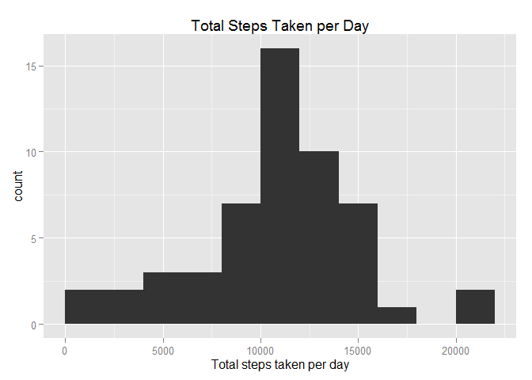
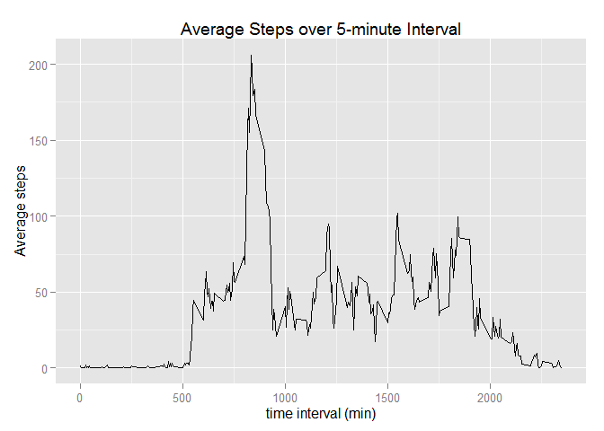
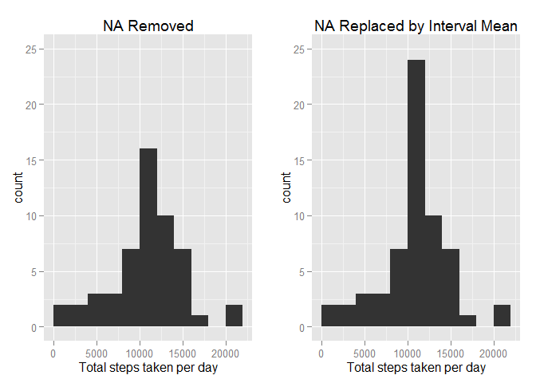
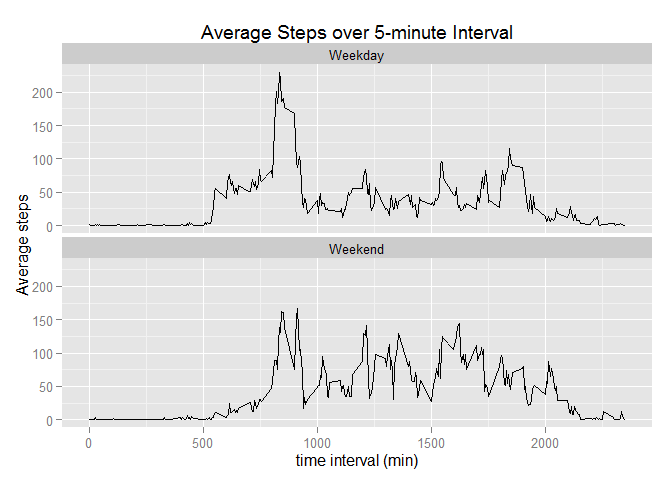

# Reproducible Research: Peer Assessment 1


## Loading and preprocessing the data

```r
setwd("F:/Data_Science/Reproducible_Research/RepData_PeerAssessment1")
if (!file.exists("activity.csv")) {
        unzip("activity.zip")
}
data <- read.csv("activity.csv")
library(dplyr)
library(ggplot2)
```


## What is mean total number of steps taken per day?
####For this part of the assignment, you can ignore the missing values in the dataset.
####1. Calculate the total number of steps taken per day.

```r
data_nona_1 <- data %>% na.omit %>% group_by(date) %>% summarize(steps = sum(steps))
```
####2. Make a histogram of the total number of steps taken each day.

```r
qplot(steps, data = data_nona_1, geom = "histogram", binwidth = 2000, xlim = c(0, 22000), xlab = "Total steps taken per day", main = "Total Steps Taken per Day")
```

\


####3. Calculate and report the mean and median of the total number of steps taken per day.

```r
summary(data_nona_1$steps)
```

```
##    Min. 1st Qu.  Median    Mean 3rd Qu.    Max. 
##      41    8841   10760   10770   13290   21190
```

## What is the average daily activity pattern?
####1. Make a time series plot (i.e. type = "l") of the 5-minute interval (x-axis) and the average number of steps taken, averaged across all days (y-axis).

```r
data_nona_2 <- data %>% na.omit %>% group_by(interval) %>% summarize(Mean_steps=mean(steps))
qplot(interval, Mean_steps, data = data_nona_2, geom = "line", xlab = "time interval (min)", ylab = "Average steps", main = "Average Steps over 5-minute Interval")
```

\


####2. Which 5-minute interval, on average across all the days in the dataset, contains the maximum number of steps?

```r
filter(data_nona_2, Mean_steps==max(Mean_steps))
```

```
## Source: local data frame [1 x 2]
## 
##   interval Mean_steps
##      (int)      (dbl)
## 1      835   206.1698
```

## Imputing missing values
####Note that there are a number of days/intervals where there are missing values (coded as NA). The presence of missing days may introduce bias into some calculations or summaries of the data.  
####1. Calculate and report the total number of missing values in the dataset (i.e. the total number of rows with NAs)

```r
colSums(is.na(data))
```

```
##    steps     date interval 
##     2304        0        0
```
####2. Devise a strategy for filling in all of the missing values in the dataset. The strategy does not need to be sophisticated. For example, you could use the mean/median for that day, or the mean for that 5-minute interval, etc. The code below uses the mean for 5-minute interval to replace NAs.

```r
allstep <- data.frame(data$steps)
allstep[is.na(allstep),] <- tapply(data$steps, data$interval, mean, na.rm=TRUE)
```
####3. Create a new dataset that is equal to the original dataset but with the missing data filled in.

```r
data_new <- cbind(allstep, data[, 2:3])
colnames(data_new)[1] <- "steps"
```
####4. Make a histogram of the total number of steps taken each day. Here I compare the new histogram with the one with all NAs removed.

```r
data_nona_3 <- data_new %>% group_by(date) %>% summarize(steps = sum(steps))
library(gridExtra)
plot1 <- qplot(steps, data = data_nona_1, geom = "histogram", binwidth = 2000, xlim = c(0, 22000), ylim = c(0,25), xlab = "Total steps taken per day", main = "NA Removed")
plot3 <- qplot(steps, data = data_nona_3, geom = "histogram", binwidth = 2000, xlim = c(0, 22000), ylim = c(0,25), xlab = "Total steps taken per day", main = "NA Replaced by Interval Mean")
grid.arrange(plot1, plot3, ncol = 2)
```

\


####Calculate and report the mean and median total number of steps taken per day. Do these values differ from the estimates from the first part of the assignment? What is the impact of imputing missing data on the estimates of the total daily number of steps?

```r
NA_removed <- summary(data_nona_1$steps)
NA_replaced_by_mean <- summary(data_nona_3$steps)
rbind(NA_removed, NA_replaced_by_mean)
```

```
##                     Min. 1st Qu. Median  Mean 3rd Qu.  Max.
## NA_removed            41    8841  10760 10770   13290 21190
## NA_replaced_by_mean   41    9819  10770 10770   12810 21190
```
####The mean stays the same as the first part. The median slightly increases to be the same as mean because the total count at mean increases.

## Are there differences in activity patterns between weekdays and weekends?
####Use the dataset with the filled-in missing values for this part.  
####1. Create a new factor variable in the dataset with two levels - "weekday" and "weekend" indicating whether a given date is a weekday or weekend day.

```r
data_new$date <- as.Date(data_new$date)
data_new$day <- as.factor(ifelse(weekdays(data_new$date) %in% c("Saturday","Sunday"), "Weekend", "Weekday"))
```
####2. Make a panel plot containing a time series plot (i.e. type = "l") of the 5-minute interval (x-axis) and the average number of steps taken, averaged across all weekday days or weekend days (y-axis).

```r
data_nona_4 <- data_new %>% group_by(interval, day) %>% summarize(Mean_steps=mean(steps))
qplot(interval, Mean_steps, data = data_nona_4, geom = "line", xlab = "time interval (min)", ylab = "Average steps", main = "Average Steps over 5-minute Interval") + facet_wrap(~ day, ncol=1)
```

\


####Yes, there are differences in patterns between weekdays and weekends.
